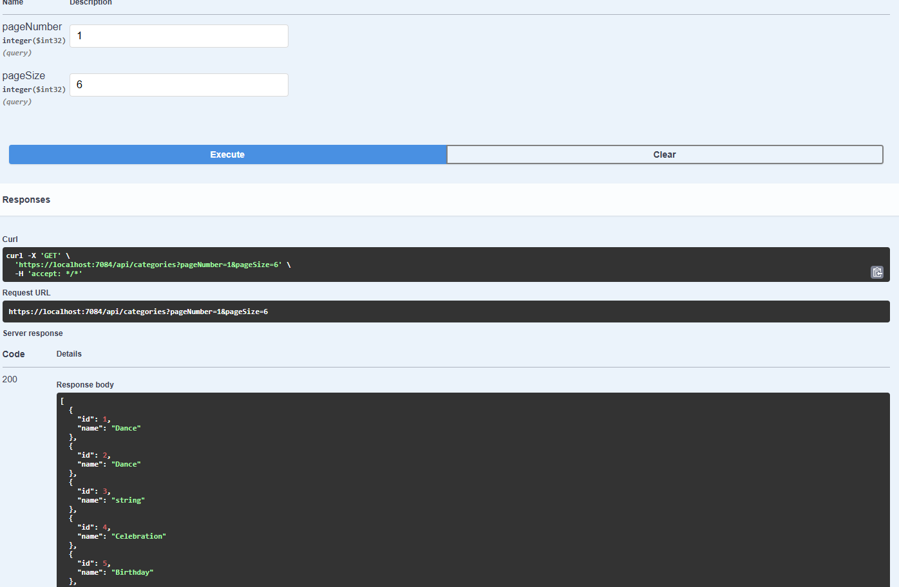
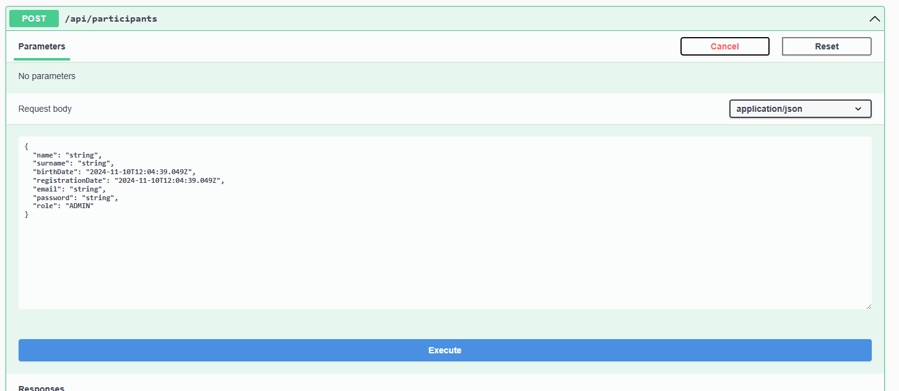
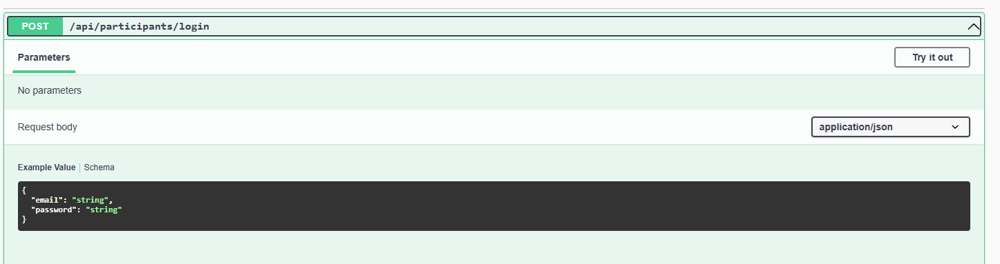
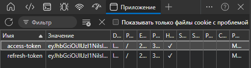

# Start up

The Events.WebAPI project being launched and database(MSSQL) will be created automatically.

You don't have to register to view categories and events.

Other actions require registration at /api/participants

After use your email and password to auth at /api/participants/login

Now your access and refresh tokens saved in cookies

